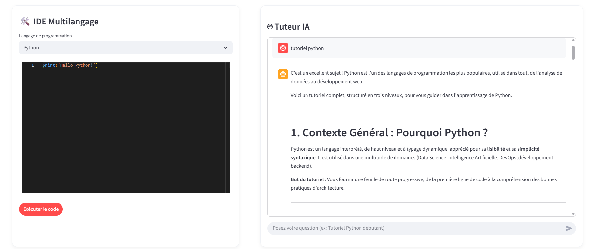
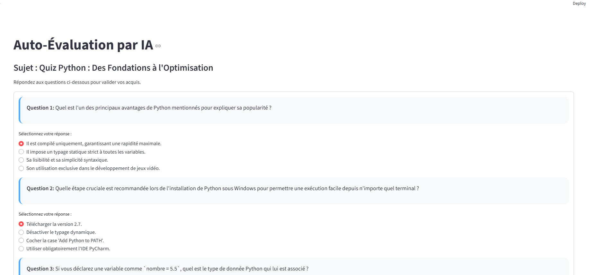

# Tuteur IA – Application d’apprentissage et d’exécution de code

## Description du projet

**Tuteur IA** est une application web interactive qui agit comme un **tuteur spécialisé en programmation et informatique**. Elle permet aux utilisateurs de :

- Poser des questions sur la programmation et obtenir des **tutoriels détaillés et structurés**.
- Exécuter du code dans différents langages via une API intégrée.
- Générer des **quiz interactifs** basés sur les tutoriels pour renforcer l’apprentissage.
- Naviguer à travers une interface conviviale avec plusieurs pages : **Home, Chat, Quiz**.

L’application combine plusieurs technologies :

- **Backend** : FastAPI pour les endpoints de chat, exécution de code et génération de quiz.
- **Frontend** : Streamlit pour l’interface utilisateur.
- **RAG (Retrieval-Augmented Generation)** : FAISS + HuggingFaceEmbeddings pour enrichir les réponses avec des documents existants.
- **IA générative** : Google Gemini (Gemini Flash) pour générer des tutoriels et quiz structurés.

---

## Fonctionnalités principales

1. **Chat avec tutoriel IA**
   - Posez des questions liées à la programmation.
   - L’IA refuse poliment les questions hors domaine.
   - Génère des tutoriels structurés en 3 niveaux : débutant, intermédiaire, avancé.

2. **Exécution de code**
   - Supporte plusieurs langages : Python, JavaScript, C, Java, Go, Ruby, PHP.
   - Utilise l’API Piston pour exécuter le code côté serveur.

3. **Quiz généré automatiquement**
   - À partir du texte du tutoriel, un quiz de 10 questions à choix multiples est généré.
   - Réponse formatée en JSON pour intégration facile sur l’interface.

4. **RAG (Retrieval-Augmented Generation)**
   - Utilisation d’un corpus local `geeks_texts.json` pour améliorer les réponses.
   - Embeddings générés avec HuggingFace + FAISS pour récupérer les documents pertinents.

---

## Installation

### 1. Cloner le projet

```bash
git clone <URL_DU_PROJET>
````

### 2. Créer un environnement virtuel

```bash
python -m venv .venv
source .venv/bin/activate  # Linux/Mac
.venv\Scripts\activate     # Windows
```

### 3. Installer les dépendances

```bash
pip install -r requirements.txt
```

### 4. Configuration des variables d’environnement

Créer un fichier `.env` à la racine du projet et ajouter :

```env
GOOGLE_API_KEY=VOTRE_CLE_API_GEMINI
```

### 5. Génération du corpus JSON

Le fichier `scraper.py` doit être exécuté **une seule fois** pour générer `geeks_texts.json`, qui sera utilisé par le RAG :

```bash
python scraper.py
```

---

## Lancement de l’application

### Backend FastAPI

```bash
uvicorn main:app --reload
```

* L’API sera disponible sur : `http://127.0.0.1:8000`
* Endpoints disponibles :

  * `/chat` : poser une question au tuteur IA
  * `/execute` : exécuter du code
  * `/generate_quiz` : générer un quiz à partir d’un tutoriel

### Frontend Streamlit

```bash
streamlit run home.py
```

* L’interface principale (Home) permet de naviguer vers :

  * **Chat**
  * **Quiz**
  * **Exécution de code**

---


## Utilisation

1. **Chat Tutoriel**

   * Entrer une question sur la programmation.
   * Recevoir un tutoriel structuré en 3 niveaux.

2. **Exécution de code**

   * Sélectionner le langage et coller le code.
   * Appuyer sur `Run` pour voir le résultat.

3. **Quiz**

   * Générer un quiz de 10 questions à choix multiples  à partir du dernier tutoriel.

---

## Captures d’écran

### Page Home


### Page Chat



### Page Quiz




## Contributions

Les contributions sont les bienvenues !
Merci de respecter les standards de codage et d’indiquer vos modifications dans des branches séparées.


